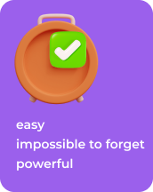

 &nbsp; 

__A simple yet powerful to-do list app that will help you organize your tasks with ease.__

For Toreminder to work, you must to stop storing information in your brain and
put anything that crosses your mind (to-dos, notes, etc) out of your head into the app. 

Beside core features like to-do list, reminders and date classification, Toreminder
also support a wide range of features that make the progress even more powerful --
priority levels, labels, recurring due dates, ...

&nbsp;

--- 

Today's To-dos           |  Next 7 Days To-dos  |  Creating New To-do
:-------------------------:|:-------------------------:|:-------------------------:
 |  | 

## To-dos
- [ ] Add Unit and Golden (Widget) tests
- [ ] Implement CI/CD via Github Actions

## Precursor
The previous is Notion Capture which is bla bla bla, you could check out more about it [here](./notion_capture.md).

## Credits
All of the illustrations are made by __Iconscout__ and __ICONS8__ from:
- https://iconscout.com
- https://icons8.com.